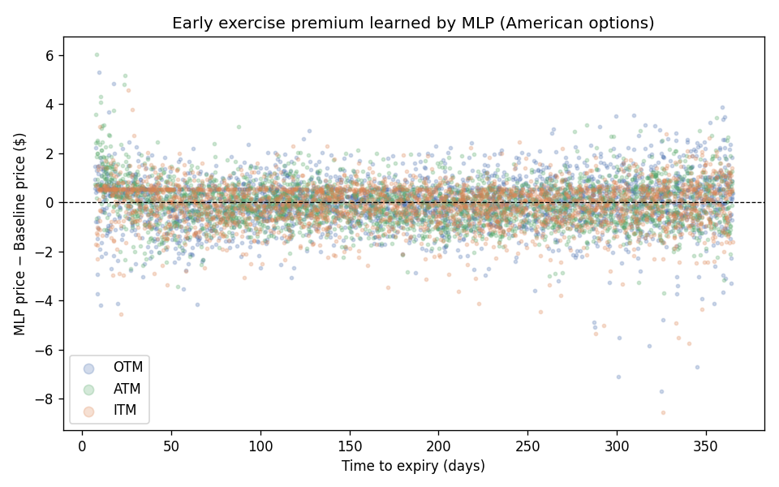
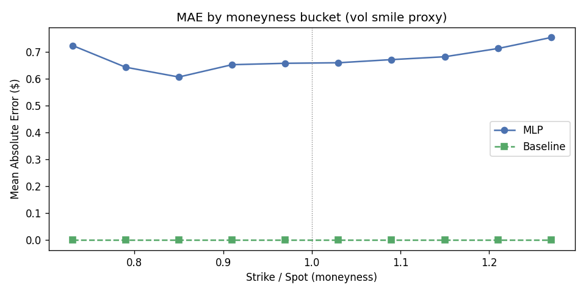
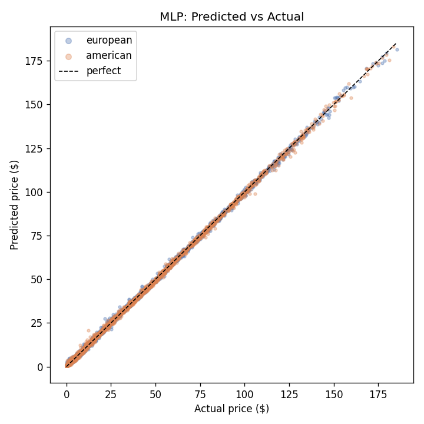

# Options Pricing with Machine Learning

Trains neural networks to price European and American stock options,
comparing against Black-Scholes and binomial tree baselines.

## Results

| Model       | MAE    | RMSE   | R²       |
|-------------|--------|--------|----------|
| MLP         | $0.677 | $0.930 | 0.999351 |
| Transformer | $1.618 | $2.091 | 0.996722 |
| BS/Binomial | $0.000 | $0.000 | 1.000000 |

*Baseline is perfect by construction — it reproduces the same formulas used to generate the data.*

## Key Findings

- MLP achieves R²=0.9994 across 50,000 test options
- MLP prices American options as accurately as European ($0.668 vs $0.686 MAE), suggesting it successfully learned early exercise premium
- Transformer underperforms MLP on this tabular task — attention mechanism adds no benefit over a well-tuned MLP for low-dimensional option features
- Hardest bucket: short expiry (tte<30), MAE=$0.90 — highest gamma, most nonlinear pricing

## Sample Plots







## How to Run

```
pip install -r requirements.txt
python data/generate.py       # generate 500k synthetic options
python train.py               # train MLP + Transformer
python evaluate.py            # evaluate + generate plots
jupyter notebook notebooks/analysis.ipynb
```

## Project Structure

```
options-pricing-ml/
├── data/
│   ├── generate.py           # synthetic dataset generator (BS + binomial tree)
│   └── options_dataset.csv   # 500k generated options (git-ignored if large)
├── models/
│   ├── mlp.py                # 8-layer MLP with BatchNorm + Dropout
│   ├── transformer.py        # per-feature token transformer
│   ├── scaler.pkl            # fitted StandardScaler
│   └── checkpoints/
│       ├── mlp_best.pt
│       └── transformer_best.pt
├── results/
│   ├── training_log_mlp.csv
│   ├── training_log_transformer.csv
│   ├── metrics.json          # full breakdown by style, moneyness, expiry
│   └── plots/
│       ├── scatter_mlp.png
│       ├── scatter_transformer.png
│       ├── error_dist.png
│       ├── vol_smile.png
│       └── early_exercise_premium.png
├── notebooks/
│   └── analysis.ipynb
├── train.py                  # training loop for both models
├── evaluate.py               # evaluation + plot generation
├── requirements.txt
└── README.md
```

## Pricing Formulas

**European options** use the Black-Scholes closed form:

```
d1 = (log(S/K) + (r - q + 0.5*vol^2)*T) / (vol*sqrt(T))
d2 = d1 - vol*sqrt(T)
call = S*exp(-q*T)*N(d1) - K*exp(-r*T)*N(d2)
put  = K*exp(-r*T)*N(-d2) - S*exp(-q*T)*N(-d1)
```

**American options** use a 100-step CRR binomial tree with early exercise check at each node.
Both implementations are vectorised with NumPy (no loops over individual options).

## Model Architecture

**MLP** (127k parameters):
```
Linear(8→256) → BN → ReLU → Dropout(0.2)  ×4
Linear(256→256→128→128→64) → BN → ReLU
Linear(64→1)
```

**Transformer** (103k parameters):
- 8 separate Linear(1→64) embedding layers, one per feature
- 2-layer TransformerEncoder: 4 heads, dim_feedforward=256
- Global average pool → Linear(64→32) → ReLU → Linear(32→1)

Both trained with AdamW (lr=1e-3, wd=1e-4), cosine annealing (T_max=50), early stopping (patience=10).
